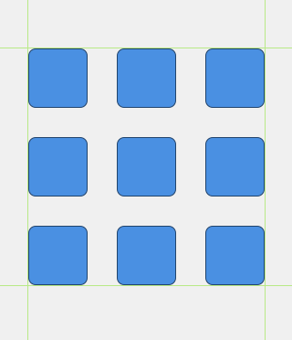

## ques
1. 姓名
2. 请用至少两种方式实现如下布局，要求：屏幕尺寸变化时维持改布局（3*3）并且每个蓝色块保持正方形，间距一致。（绿色为辅助线，不用实现）

    答案：见ques2文件夹

3. 请使用React/vue实现一个如下图所示的通用弹窗组件，要求：  
    -1：弹层打开时可以在console里打印出“open”，关闭时可打印出“close”。  
    -2：点击弹层中的“确认”按钮时，可将弹层内文本框输入的内容打印至console  
    -3: 可以使用键盘上的ESC键关闭弹层  

    答案：见layer-component文件夹

4. 假设在 a.com域下有一段js代码需要异步请求b.com域下的数据，会出现什么问题，如何解决？

    答案：见ques4文件夹

5. 什么情况下会进行git rebase, 如何操作？

    merge是单纯的合并，rebase有冲突会提示解决。如果想让分支历史看起来像没有合并一样可以用rebase.

    操作步骤：  
    - git checkout -b dev   #新建并切换到开发分支dev
    - git add .     # 添加
    - git commit  -m "提交说明"   #commit
    - git fetch origin  #与主干同步
    - git checkout master # 切换到主分支
    - git rebase dev
    - git push

6. 你日常使用什么前端构建工具？请列出基本配置：
   webpack;   
   基本配置：
   - entry
   - output
   - plugins
   - module
   - webpackDevServer

   详情见ques6文件夹

